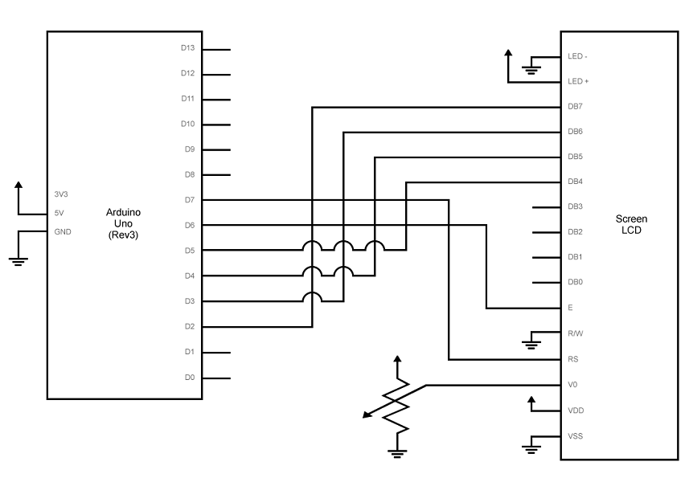

# Smart Parking Management System

## Overview

The Smart Parking Management System is a project designed to efficiently manage parking spaces using an Arduino setup. It incorporates an LCD display, LEDs, and a servo motor to provide real-time information and control access to parking spots.

## Features

- **Real-Time Parking Management**: Displays available parking spots and status messages on an LCD.
- **Entry and Exit Control**: Uses push buttons to manage entry and exit of vehicles, adjusting the count of available parking spaces.
- **Visual Indicators**: Utilizes LEDs to signal entry/exit permissions.
- **Automated Gate**: Controls a servo motor to open and close the parking gate based on vehicle entry and exit.

## Components Used

- **Arduino UNO**: Main microcontroller board.
- **LCD Display**: For displaying status messages and available parking spots.
- **Servo Motor**: To control the gate for entry and exit.
- **LEDs**: To indicate entry and exit status.
- **Push Buttons**: For vehicle entry and exit.

## Circuit Diagram



## Code

### Main Code

The main code handles the parking management logic and control of the system components. It manages parking spaces, controls the gate, and displays messages on the LCD.

```matlab
clc;
clear;
close all;

a = arduino('Com3','UNO','Libraries',{'ExampleLCD/LCDAddon','Servo'}); %arduino argument and involve libraries
Spots = 13; % available parking spaces 
Entry_pin = 'A0'; % push button for entry
Exit_pin = 'A1'; % push button for exit
LED_Green = 'D13'; % Green signal for enter or exit
LED_Red = 'D12'; % Red signal for restriction
servo_pin = 'D9'; % servo motor control logic pin
Servo_close = 0; % servo motor position at rest
Servo_open = 0.50; %  servo motor position at open gate condition
Servo_Position = servo(a, servo_pin); 
writePosition(Servo_Position, Servo_close); %default close position
lcd=addon(a,'ExampleLCD/LCDAddon','RegisterSelectPin','D7','EnablePin','D6','DataPins',{'D5','D4','D3','D2'}); %lcd declaration 
initializeLCD(lcd); %start LCD Display 
writeDigitalPin (a, LED_Red,1); %default red light on for restrict the vehicle

 printLCD(lcd,'Welcome!!!'); %Greetings

 pause(1); %pause the dispay message for given amount of time
 clearLCD(lcd); %Clear the lcd screen
 
 printLCD(lcd,'Bonjour!!!'); 

 pause(1);
 clearLCD(lcd); 
 
 %Group members Information & IDs
 printLCD(lcd,'1) Gururaja S R');
 
 pause(1); 
 clearLCD(lcd);
 
 
% set up the pin position and assign the modes

configurePin (a, Entry_pin, 'Pullup'); 
configurePin (a, Exit_pin, 'Pullup');
configurePin (a, LED_Green, 'DigitalOutput');
configurePin (a, LED_Red, 'DigitalOutput');

 while 1 % creating a loop (1 means the true condition)

     Enter = readDigitalPin (a, Entry_pin); %read the enter digital pin and position
     Exit = readDigitalPin (a, Exit_pin); %read the exit digital pin and position

     if (Spots > 0) % IF block for run message on lcd with variable spots
        
        clearLCD(lcd);

        printLCD(lcd,['Available : ',num2str(Spots)]); % will show the available parking slots
        printLCD(lcd,'Welcome!!!'); 


     elseif (Spots == 0)

        clearLCD(lcd);

        printLCD(lcd,'NoSlot available') % no space between no and slot because for 16 digit limit
        printLCD(lcd,'Plz Come Later'); 

     end

     % (output 0 means wire is connected and 1 means its not connected)
     % when press the push button it complete the circuit the Enters value
     % change from 1 to 0 and While loop is executed with AND logic
     if (Enter == 0 && Spots > 0) %Logic for entry 

         writeDigitalPin (a, LED_Red, 0);  % Red LED turn off  (0 = off and 1=on)

         writeDigitalPin (a, LED_Green, 1);  % Green LED turn On

         writePosition (Servo_Position, Servo_open); %Gate is open

         pause(1);

         writePosition (Servo_Position, Servo_close); % Gate is close 

         writeDigitalPin (a, LED_Green, 0);

         writeDigitalPin (a, LED_Red, 1);  

         Spots = Spots - 1; % number of parking space decreases by one


     elseif ((Exit == 0) && (Spots < 13)) %Logic for exit point

         writeDigitalPin(a, LED_Red,0);

         writeDigitalPin(a, LED_Green,1); 

         writePosition(Servo_Position, Servo_open);% Gate is open

         pause(1); 

         writePosition(Servo_Position, Servo_close); 

         writeDigitalPin(a, LED_Green,0);
         
         writeDigitalPin(a, LED_Red,1);

         Spots = Spots + 1; % number of parking space increases by one

     end

 end 
```

### LCDAddon.m

The `LCDAddon.m` file defines a MATLAB class to manage an LCD display connected to an Arduino. It provides methods to initialize the LCD, clear the screen, and print messages. 

```matlab
classdef LCDAddon < matlabshared.addon.LibraryBase 
    % This is an example to display a user input message on an LCD connected to arduino. 
    % It uses an LCD with HD44780 chipset to display the message 
    %
    % To begin with connect to an Arduino Uno board on COM port 3 on Windows:
    % a = arduino('COM3','Uno','Libraries','ExampleLCD/LCDAddon');
    %
    % lcd = addon(a,'ExampleLCD/LCDAddon','RegisterSelectPin','D7','EnablePin','D6','DataPins',{'D5','D4','D3','D2'});
    %
    % initializeLCD(lcd, 'Rows', 2, 'Columns', 2);
    %
    % printLCD(lcd,'Hello World!');
    %
    % clearLCD(lcd);
    %
    % <a href="matlab:helpview(arduinoio.internal.getDocMap, ''arduino_sdk'')">
    
    % Copyright 2015-2020 The MathWorks, Inc.
  
    % Define command IDs for all public methods of the class object
    properties(Access = private, Constant = true)
        LCD_CREATE     = hex2dec('00')
        LCD_INITIALIZE = hex2dec('01')
        LCD_CLEAR      = hex2dec('02')
        LCD_PRINT      = hex2dec('03')
        LCD_DELETE     = hex2dec('04')
    end 
    
    properties(SetAccess = protected)
        RegisterSelectPin
        EnablePin
        DataPins
    end
    % Include all the 3p source files
    properties(Access = protected, Constant = true)
        LibraryName = 'ExampleLCD/LCDAddon'
        DependentLibraries = {}
        LibraryHeaderFiles = 'LiquidCrystal/LiquidCrystal.h'
        CppHeaderFile = fullfile(arduinoio.FilePath(mfilename('fullpath')), 'src', 'LCD.h')
        CppClassName = 'LCD'        
    end
    
    properties(Access = private)
        ResourceOwner = 'ExampleLCD/LCDAddon';
        Rows
        Columns
    end
    
    % Create methods for each command ID to be supported by the addon
    methods(Hidden, Access = public)
        % varargin is user input and contains the pins that connect the LCD Data Pins and the arduino
        function obj = LCDAddon(parentObj,varargin)
            if(nargin < 7)
                matlabshared.hwsdk.internal.localizedError('MATLAB:narginchk:notEnoughInputs');
            elseif nargin > 7
                matlabshared.hwsdk.internal.localizedError('MATLAB:narginchk:tooManyInputs');
            end 

             try
                p = inputParser;
                addParameter(p, 'RegisterSelectPin',[]);
                addParameter(p, 'EnablePin', []);
                addParameter(p, 'DataPins', []);
                parse(p, varargin{1:end});
             catch e
                 throwAsCaller(e);
             end
            obj.Parent = parentObj;            
            obj.RegisterSelectPin = p.Results.RegisterSelectPin;
            obj.EnablePin = p.Results.EnablePin;
            obj.DataPins = p.Results.DataPins;
            inputPins = [cellstr(obj.RegisterSelectPin) cellstr(obj.EnablePin) obj.DataPins];
            count = getResourceCount(obj.Parent,obj.ResourceOwner);
            % Since this example allows implementation of only 1 LCD
            % shield, error out if resource count is more than 0
            if count > 0
                error('You can only have 1 LCD shield');
            end 
            incrementResourceCount(obj.Parent,obj.ResourceOwner);    
            createLCD(obj,inputPins);
        end
    
        function createLCD(obj,inputPins)
            try
                % Initialize command ID for each method for appropriate handling by
                % the commandHandler function in the wrapper class.
                cmdID = obj.LCD

_CREATE;
                
                % Allocate the pins connected to the LCD
                for iLoop = inputPins
                    configurePinResource(obj.Parent,iLoop{:},obj.ResourceOwner,'Reserved');
                end
                
                % Call the sendCommand function to link to the appropriate method in the Cpp wrapper class
                % Define inputs to be sent via sendCommand function. Inputs must be array of integers or empty array.
                terminals = getTerminalsFromPins(obj.Parent,inputPins);
                sendCommand(obj, obj.LibraryName, cmdID, terminals);
            catch e
                throwAsCaller(e);
            end
        end
    end
    
    methods(Access = protected)
        function delete(obj)
            try
                parentObj = obj.Parent;
                % Clear the pins that have been configured to the LCD shield
                inputPins = [cellstr(obj.RegisterSelectPin) cellstr(obj.EnablePin) obj.DataPins];
                for iLoop = inputPins
                    configurePinResource(parentObj,iLoop{:},obj.ResourceOwner,'Unset');
                end
                % Decrement the resource count for the LCD
                decrementResourceCount(parentObj, obj.ResourceOwner);
                cmdID = obj.LCD_DELETE;
                inputs = [];
                sendCommand(obj, obj.LibraryName, cmdID, inputs);
            catch
                % Do not throw errors on destroy.
                % This may result from an incomplete construction.
            end
        end  
    end

        
    methods(Access = public)
        % Initialize the LCD size with user specified colums and rows                                                
        function initializeLCD(obj,varargin)   
            % Using inputParser to manage inputs to this function such that
            % it accepts row number and column number as two Name-Value
            % pair. Also, if not given, the default number for row is 2 and
            % the default number for column is 16.
            p = inputParser;
            p.PartialMatching = true;
            % If not specified, default to 2 rows and 16 columns
            addParameter(p, 'Rows', 2);
            addParameter(p, 'Columns', 16);
            parse(p, varargin{:});
            output = p.Results;
            
            obj.Rows = output.Rows;
            obj.Columns = output.Columns;
            inputs = [output.Columns output.Rows];
            
            cmdID = obj.LCD_INITIALIZE;  
            sendCommand(obj, obj.LibraryName, cmdID, inputs);
        end
        
        % Clear the LCD screen
        function clearLCD(obj)
            cmdID = obj.LCD_CLEAR;
            inputs = [];
            sendCommand(obj, obj.LibraryName, cmdID, inputs);
        end
        
        % Print the input message on the LCD
        function printLCD(obj,message)
            cmdID = obj.LCD_PRINT;
            
            if numel(message) > 16
                error('Cannot print more than 16 characters')
            end
            
            inputs = [double(message) obj.Columns obj.Rows];
            sendCommand(obj, obj.LibraryName, cmdID, inputs); 
        end       
    end
end
```

## Installation and Setup

1. **Hardware Setup**:
   - Connect the components as shown in the circuit diagram.
   - Ensure the Arduino is connected to the correct COM port.

2. **Software Setup**:
   - Install the required Arduino libraries: `ExampleLCD/LCDAddon`, `Servo`.
   - Upload the provided code to the Arduino using the Arduino IDE.
   - Save the `LCDAddon.m` file in your MATLAB path or current directory.

## Usage

1. **Starting the System**:
   - Power up the Arduino and observe the LCD and LED indicators.

2. **Using the System**:
   - Press the entry button to indicate a vehicle entering. The gate will open, and the number of available spots will decrease.
   - Press the exit button to indicate a vehicle exiting. The gate will open, and the number of available spots will increase.

## License

This project is licensed under the MIT License - see the [LICENSE](LICENSE) file for details.

## Acknowledgements

- [Arduino Documentation](https://www.arduino.cc/en/Guide)
- [LCD Library Documentation](https://www.mathworks.com/help/supportpkg/arduino/ref/lcd-add-on.html)
